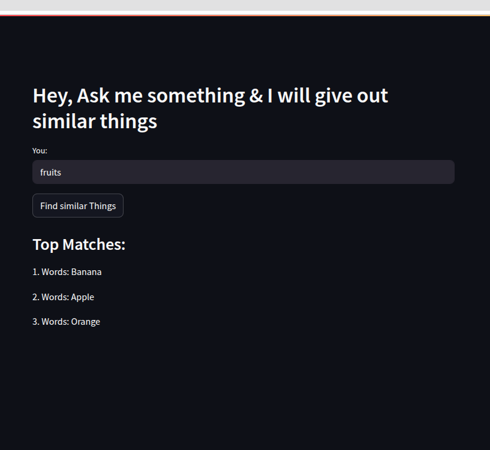

# WordWise 🧠✨

A smart, AI-powered Streamlit app that helps children (and curious minds!) discover similar words and concepts with ease. Built with embeddings and vector search, it enables interactive, educational exploration through natural language queries.

## 🌐 Live Demo

🚀 Check it out here: [WordWise App](https://wordwise-shivam.streamlit.app/)

---

## 📖 Description

**WordWise** is an educational assistant designed to respond to natural language inputs by finding semantically similar words or concepts from a dataset. It leverages Google Generative AI embeddings and FAISS vector search to identify and retrieve the most relevant matches.

**Main Features:**
- Simple and friendly interface for kids to type and learn.
- Uses semantic search to provide intelligent suggestions.
- Built with Streamlit for fast and interactive web deployment.

---

## 🖼️ Screenshots

> 
> 

---

## 💾 Installation Instructions

Follow the steps below to run the project locally:
```bash
pip install -r requirements.txt
streamlit run app.py
```
### 1. Clone the Repository
```bash
git clone https://github.com/your-username/wordwise.git
cd wordwise
```
